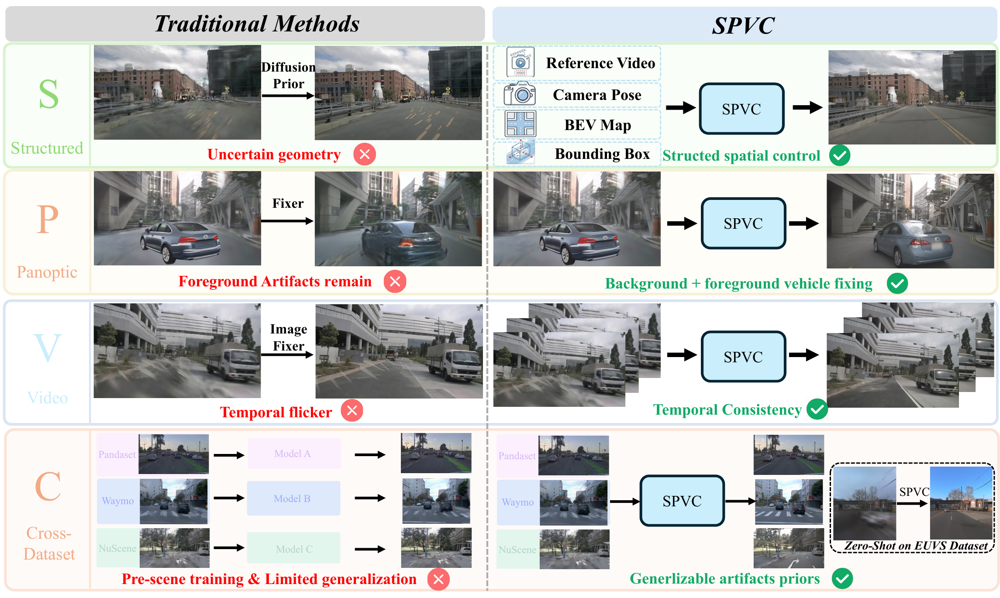

# SPVC

<p align="center">
  
</p>

SPVC is a minimal Wan2.2-Fun-A14B-Control codebase for LoRA training and novel-view inference. It keeps only the DiffSynth components required by the SPVC workflow.

The supported conditions are:

- control video
- HD map and projected 3D bounding boxes
- reference video
- relative camera pose

## Environment setup

Python 3.10.1 or newer is required. The recommended setup starts with a dedicated `spvc` Conda environment:

```bash
conda create -n spvc python=3.10.1 -y
conda activate spvc
python -m pip install --upgrade pip setuptools wheel
```

Install the PyTorch and torchvision builds compatible with the CUDA driver on your machine. Use the command generated by the [PyTorch installation selector](https://pytorch.org/get-started/locally/). For example, after selecting the correct CUDA version:

```bash
pip install torch torchvision
```

Install SPVC from the repository root:

```bash
pip install -e .
```

This follows the source-install workflow recommended by [DiffSynth-Studio](https://github.com/modelscope/DiffSynth-Studio). Do not install the separate PyPI `diffsynth` package into this environment because SPVC includes its own minimized `diffsynth` package.

A reproducible Conda specification is also included:

```bash
conda env create -f environment.yml
conda activate spvc
pip install -e . --no-deps
```

Verify the environment:

```bash
python -c "import torch, diffsynth; print(torch.__version__, torch.cuda.is_available())"
python scripts/eval_novel_views.py --help
```

Model files are downloaded from Hugging Face into `./models` by default. Set `DIFFSYNTH_MODEL_BASE_PATH` to use another model directory.

## Dataset format

Training metadata is a JSON list. Every item contains `prompt` and `video`, plus the condition paths enabled through `--data_file_keys` and `--extra_inputs`. Video paths are loaded as RGB frames. `cam_pose` is a PyTorch tensor with shape `(F, 4, 4)` or `(B, F, 4, 4)`.

`reference_combined_video` is the rendered RGB condition video containing both the HD map and projected 3D bounding boxes. The inference CLI calls the same input `--hdmap_bbox_video` to make its meaning explicit.

```json
{
  "prompt": "A realistic autonomous-driving scene.",
  "video": "gt/001_000.mp4",
  "control_video": "control/001_000.mp4",
  "reference_video": "reference/001_000.mp4",
  "reference_combined_video": "conditions/hdmap_bbox_001_000.mp4",
  "cam_pose": "poses/001_000.pt"
}
```

## Training

SPVC training has two curriculum stages, and each stage trains an independent high-noise and low-noise LoRA. This gives four training runs in total:

| Run | Training data | Initialization | Timestep boundary |
| --- | --- | --- | --- |
| Stage I high noise | control, reference, camera pose | Wan high-noise base model | `[0, 0.358]` |
| Stage I low noise | control, reference, camera pose | Wan low-noise base model | `[0.358, 1]` |
| Stage II high noise | Stage I inputs plus HD map/bbox | Stage I high-noise LoRA | `[0, 0.358]` |
| Stage II low noise | Stage I inputs plus HD map/bbox | Stage I low-noise LoRA | `[0.358, 1]` |

Stage II high noise must load the Stage I high-noise checkpoint, while Stage II low noise must load the Stage I low-noise checkpoint.

Two executable scripts contain all four commands:

- `train_stage_I.sh`: trains Stage I high noise and then Stage I low noise.
- `train_stage_II.sh`: trains Stage II high noise and then Stage II low noise.

The reference setup uses single-node, four-GPU PyTorch DDP through Accelerate. It does not use FSDP, DeepSpeed ZeRO-2/3, or Megatron. This is LoRA training rather than full-parameter Wan 14B training: the base model is replicated and frozen on every process, while LoRA and the camera-pose encoder are optimized. The training code loads model weights as BF16 itself and forces gradient checkpointing, so Accelerate uses `mixed_precision: "no"`.

The repository includes `accelerate_config.yaml`, and both training scripts pass it explicitly. Its contents are:

```yaml
compute_environment: LOCAL_MACHINE
debug: false
distributed_type: MULTI_GPU
downcast_bf16: "no"
enable_cpu_affinity: false
machine_rank: 0
main_training_function: main
mixed_precision: "no"
num_machines: 1
num_processes: 4
rdzv_backend: static
same_network: true
tpu_env: []
tpu_use_cluster: false
tpu_use_sudo: false
use_cpu: false
```

`CUDA_VISIBLE_DEVICES` must expose the same number of GPUs as `num_processes`. To use a different topology, create another YAML and set `ACCELERATE_CONFIG_FILE=/path/to/config.yaml`; do not silently reuse a DeepSpeed or FSDP configuration.

Run Stage I first:

```bash
CUDA_VISIBLE_DEVICES=0,1,2,3 bash train_stage_I.sh
```

The Stage I defaults reproduce `train_stage_I.sh` from the full project:

- dataset: `/data01/lg/OmniFix/stage-I-train-data/processed`
- metadata: `dataset_ref_video_cam_pose.json`
- fields: `video,control_video,reference_video,cam_pose`
- resolution and length: `448x800`, 25 frames
- dataset repeat: 10
- epochs: 2

After both Stage I runs finish, select the final checkpoint from each noise branch and run Stage II:

```bash
SPVC_STAGE_I_HIGH_CHECKPOINT=/path/to/high_noise_stage_I/step-1040.safetensors \
SPVC_STAGE_I_LOW_CHECKPOINT=/path/to/low_noise_stage_I/step-2080.safetensors \
CUDA_VISIBLE_DEVICES=0,1,2,3 \
bash train_stage_II.sh
```

The Stage II defaults reproduce `train_stage_II.sh` from the full project:

- dataset: `/data01/hs/DiffSynth-Studio/stage-II-train-data/processed`
- metadata: `dataset_ref_vid_cam_pose_with_bevbbox.json`
- fields: `video,control_video,reference_video,cam_pose,reference_combined_video`
- resolution and length: `448x800`, 25 frames
- dataset repeat: 5
- epochs: 2

Checkpoint step numbers depend on dataset size, GPU process count, and Accelerate configuration. The Stage II script defaults to the checkpoints produced by the reference runs (`step-1040` for high noise and `step-2080` for low noise), but the two checkpoint variables should be overridden when the final filenames differ.

The following environment variables make the scripts portable:

| Variable | Purpose |
| --- | --- |
| `SPVC_STAGE_I_DATA_ROOT` | Stage I processed-data root |
| `SPVC_STAGE_I_METADATA` | Stage I metadata JSON |
| `SPVC_STAGE_II_DATA_ROOT` | Stage II processed-data root |
| `SPVC_STAGE_II_METADATA` | Stage II metadata JSON |
| `SPVC_STAGE_I_HIGH_CHECKPOINT` | Stage I high-noise LoRA used to initialize Stage II high noise |
| `SPVC_STAGE_I_LOW_CHECKPOINT` | Stage I low-noise LoRA used to initialize Stage II low noise |
| `SPVC_OUTPUT_ROOT` | Directory containing all four output folders |
| `SPVC_NUM_FRAMES` | Number of frames, default `25` |
| `ACCELERATE_CONFIG_FILE` | Accelerate YAML; defaults to `./accelerate_config.yaml` |

For example, an open-source installation can use custom dataset and output paths without editing the scripts:

```bash
SPVC_STAGE_I_DATA_ROOT=/datasets/spvc/stage-I \
SPVC_OUTPUT_ROOT=/checkpoints/spvc \
bash train_stage_I.sh

SPVC_STAGE_II_DATA_ROOT=/datasets/spvc/stage-II \
SPVC_OUTPUT_ROOT=/checkpoints/spvc \
SPVC_STAGE_I_HIGH_CHECKPOINT=/checkpoints/spvc/Wan2.2-Fun-A14B-Control_high_noise_stage_I/final.safetensors \
SPVC_STAGE_I_LOW_CHECKPOINT=/checkpoints/spvc/Wan2.2-Fun-A14B-Control_low_noise_stage_I/final.safetensors \
bash train_stage_II.sh
```

## Novel-view inference

The inference entry point processes one sample at a time, like a conventional model inference script. It accepts the four SPVC conditions explicitly:

```bash
python scripts/eval_novel_views.py \
  --control_video /path/to/control.mp4 \
  --hdmap_bbox_video /path/to/rendered_hdmap_and_3d_bbox.mp4 \
  --reference_video /path/to/reference.mp4 \
  --cam_pose /path/to/relative_camera_pose.pt \
  --cam_pose_ckpt /path/to/checkpoint_with_relpose_ecam.safetensors \
  --lora_ckpt_high /path/to/high_noise_lora.safetensors \
  --lora_ckpt_low /path/to/low_noise_lora.safetensors \
  --height 464 \
  --width 800 \
  --num_frames 25 \
  --output outputs/sample.mp4
```

`--hdmap_bbox_video` is an alias for the model-side `reference_combined_video`. It must use the same rendering convention as the training data. If `--cam_pose` is omitted, camera-pose conditioning is disabled. When it is enabled, `--cam_pose_ckpt` must contain `relpose_ecam` weights; if omitted, the high-noise LoRA checkpoint is used as the source.

Use `--no-tiled` to disable tiled VAE processing. Use `--vram_limit` to set the available VRAM budget in GiB when layer-level offloading is enabled.

## Scope and attribution

This repository excludes unrelated DiffSynth model families, pipelines, demos, notebooks, backups, generated caches, and optional Wan modalities. See `NOTICE` for upstream attribution and `LICENSE` for license terms.
